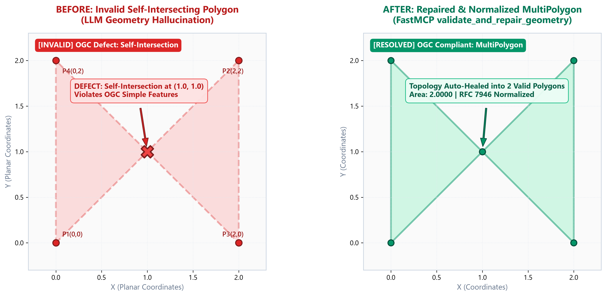
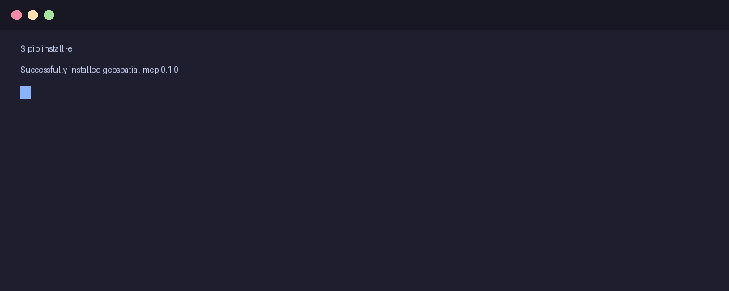

# 🌍 Geospatial MCP Server

[](https://pypi.org/project/geospatial-mcp/)
[](LICENSE)
[](https://www.python.org/)
[](https://modelcontextprotocol.io/)
[](https://pytest.org)

A zero-dependency (no GDAL/C++ build hell) Model Context Protocol (MCP) server that equips AI Agents (Claude, Cursor, Antigravity) with deterministic spatial analysis, GeoJSON auto-repair, and accurate projected metric calculations.

<!-- Instant Visual Value: Topology Auto-Healing Comparison -->


<!-- Terminal interaction demo -->


---

## ⚡ The Problem It Solves

Large Language Models (LLMs) are notoriously bad at spatial reasoning and Cartesian mathematics:
- **Geometry Hallucination**: Self-intersecting polygons (bow-tie / figure-8 errors) and unclosed coordinate rings crash downstream GIS pipelines and map renderers.
- **Scale Distortion**: Treating spherical WGS84 geographic coordinates (latitude/longitude degrees) as flat Euclidean planes results in catastrophic area and perimeter errors (often 30% to 500% off depending on latitude).
- **Topology Blindness**: Inability to deterministically resolve point-in-polygon containment, spatial intersection surfaces, separation distances, and metric buffering.

`geospatial-mcp` bridges this gap by providing a lightweight, high-performance, GEOS-backed C-extension engine without heavy GIS infrastructure overhead.

---

## 🚀 Quickstart (30 Seconds)

### Option 1: Run with UVX (Recommended, Zero Install)
No local repository clone or manual environment setup required:

```json
{
  "mcpServers": {
    "geospatial": {
      "command": "uvx",
      "args": ["geospatial-mcp"]
    }
  }
}
```

### Option 2: Local Installation & Development

1. **Clone and create virtual environment**:
   ```bash
   git clone https://github.com/Treasurezqq-Sketch/geospatial-mcp.git
   cd geospatial-mcp

   python -m venv .venv
   # Windows (PowerShell):
   .\.venv\Scripts\Activate.ps1
   # Linux / macOS:
   source .venv/bin/activate
   ```

2. **Install package in editable mode**:
   ```bash
   pip install -e .
   pip install pytest
   ```

3. **Configure MCP Client (Claude Desktop / Cursor / Antigravity)**:
   ```json
   {
     "mcpServers": {
       "geospatial": {
         "command": "python",
         "args": ["-m", "geospatial_mcp.server"],
         "cwd": "/path/to/geospatial-mcp"
       }
     }
   }
   ```

---

## 🛠️ Tools Reference

All tools are exposed via standard MCP transports (stdio) and feature robust input tolerance: they natively accept standard GeoJSON strings, raw coordinate arrays, GeoJSON dictionaries, Feature / FeatureCollection objects, and Markdown-wrapped JSON (` ```json `) without crashing.

### 1. `validate_and_repair_geometry`
Validates topological compliance against OGC Simple Features standards. If topological defects exist (e.g., self-intersecting bow-tie polygons or unclosed linear rings), it extracts the exact cause of failure and automatically heals the geometry into a compliant GeoJSON object with RFC 7946 normalized ring winding.

- **Parameters**:
  - `geojson` (`str | dict | list`, required): GeoJSON geometry, Feature, FeatureCollection, or raw coordinate array.
- **Returns**:
  - `is_valid` (`bool`): Whether the original geometry was topologically valid.
  - `error_reason` (`str | null`): Exact topological defect description if invalid (e.g. `Self-intersection[1 1]` or `Points of LinearRing do not form a closed linestring`).
  - `repaired_geojson` (`dict | null`): Compliant, self-healed GeoJSON geometry.

#### Example Call
```json
{
  "name": "validate_and_repair_geometry",
  "arguments": {
    "geojson": {
      "type": "Polygon",
      "coordinates": [[[0, 0], [2, 2], [2, 0], [0, 2], [0, 0]]]
    }
  }
}
```
#### Response
```json
{
  "is_valid": false,
  "error_reason": "Self-intersection[1 1]",
  "repaired_geojson": {
    "type": "MultiPolygon",
    "coordinates": [
      [[[0.0, 0.0], [1.0, 1.0], [0.0, 2.0], [0.0, 0.0]]],
      [[[1.0, 1.0], [2.0, 0.0], [2.0, 2.0], [1.0, 1.0]]]
    ]
  }
}
```

---

### 2. `calculate_accurate_metrics`
Eliminates spherical degree distortion by deriving the optimal local UTM projection zone (`EPSG:32601-32660` for Northern hemisphere or `EPSG:32701-32760` for Southern hemisphere) from the polygon centroid, projecting to a planar Cartesian coordinate system via PyProj, and calculating distortion-free surface area and perimeter.

- **Parameters**:
  - `geojson` (`str | dict | list`, required): Polygon or MultiPolygon GeoJSON.
  - `unit` / `target_unit` (`str`, optional, default `"sq_meters"`): Desired unit (`"sq_meters"`, `"sq_kilometers"`, or `"hectares"`). Fully backwards-compatible with dual alias parsing.
- **Returns**:
  - `area` (`float`): Planar area in the requested unit.
  - `perimeter_meters` (`float`): Total boundary length in meters.
  - `unit` (`str`): Target unit used.
  - `projected_epsg` (`int`): EPSG integer code of the metric UTM projection applied (e.g. `32651`).

#### Example Call
```json
{
  "name": "calculate_accurate_metrics",
  "arguments": {
    "geojson": {
      "type": "Polygon",
      "coordinates": [[[121.47, 31.23], [121.48, 31.23], [121.48, 31.24], [121.47, 31.24], [121.47, 31.23]]]
    },
    "unit": "hectares"
  }
}
```
#### Response
```json
{
  "area": 105.74,
  "perimeter_meters": 4118.62,
  "unit": "hectares",
  "projected_epsg": 32651
}
```

---

### 3. `check_spatial_relationship`
Evaluates topological relationship predicates between two geometries (`contains`, `within`, `intersects`, `disjoint`). Automatically returns the shared intersection area in $m^2$ if overlapping, or the minimum metric separation distance in meters if disjoint.

- **Parameters**:
  - `geom_a` (`str | dict | list`, required): First spatial object.
  - `geom_b` (`str | dict | list`, required): Second spatial object.
  - `predicate` (`str`, optional, default `"intersects"`): Predicate to evaluate (`"contains"`, `"within"`, `"intersects"`, `"disjoint"`).
- **Returns**:
  - `result` (`bool`): Boolean verdict for the requested predicate.
  - `details` (`dict`): Quantitative measurements including `intersection_area_sq_meters`, `distance_meters`, and `projected_epsg`.

#### Example Call
```json
{
  "name": "check_spatial_relationship",
  "arguments": {
    "geom_a": {"type": "Polygon", "coordinates": [[[0, 0], [2, 0], [2, 2], [0, 2], [0, 0]]]},
    "geom_b": {"type": "Polygon", "coordinates": [[[1, 1], [3, 1], [3, 3], [1, 3], [1, 1]]]},
    "predicate": "intersects"
  }
}
```
#### Response
```json
{
  "result": true,
  "details": {
    "predicate": "intersects",
    "projected_epsg": 32631,
    "intersection_area_sq_meters": 12285149372.45,
    "distance_meters": 0.0
  }
}
```

---

### 4. `generate_buffer`
Constructs an accurate metric buffer (expansion or erosion) in the local UTM coordinate system, auto-heals any resulting self-intersections, and projects back to standard EPSG:4326 WGS84 GeoJSON.

- **Parameters**:
  - `geojson` (`str | dict | list`, required): Input geometry.
  - `distance_meters` (`float`, required): Buffer radius in meters (positive expands, negative erodes).
  - `quad_segs` (`int`, optional, default `8`): Quadrant segments for circular arc approximation.
- **Returns**:
  - `buffered_geojson` (`dict | null`): Normalized RFC 7946 GeoJSON dictionary in EPSG:4326.

#### Example Call
```json
{
  "name": "generate_buffer",
  "arguments": {
    "geojson": {"type": "Point", "coordinates": [121.5, 31.2]},
    "distance_meters": 500.0,
    "quad_segs": 16
  }
}
```

---

## 🏗️ Architecture & Project Structure

`geospatial-mcp` is designed to be completely decoupled from bulky C/C++ GIS frameworks:

```
geospatial-mcp/
├── pyproject.toml              # Hatchling packaging and dependency constraints
├── README.md                   # Complete architectural guide and tool references
├── src/
│   └── geospatial_mcp/
│       ├── __init__.py         # Package root
│       ├── server.py           # FastMCP service instance & tool entrypoints
│       ├── core/               # Pure C-extension geometry engine
│       │   ├── __init__.py
│       │   ├── projection.py   # Dynamic UTM zone deduction & CRS reprojector
│       │   └── geometry.py     # Topology validation, metric calculations, relations & buffer
│       └── models.py           # Pydantic v2 schemas (unit / target_unit alias support)
└── tests/
    ├── __init__.py
    ├── test_geometry.py        # Core geometry, projection, bowtie repair, equator tests
    └── test_server.py          # FastMCP tool invocation, input tolerance, & error tests
```

### Why Zero GDAL?
Traditional GIS tools bundle GDAL, PROJ C libraries, and Python wrappers (Fiona, GeoPandas) that create:
- Massive container image sizes (> 1.5 GB).
- Platform-dependent C++ build failures and DLL hell on Windows / macOS.
- Potential process segmentation faults during concurrent execution.

`geospatial-mcp` uses pure **`shapely>=2.0`** (which packages standalone GEOS C libraries as pre-compiled wheels) and **`pyproj`**. It installs in seconds via `pip` or `uvx` with zero compilation steps.

---

## 🛡️ Fault Tolerance & Defensive Engineering

1. **Unclosed Linear Rings**: In RFC 7946, polygon exterior and interior rings must be closed (first coordinate identical to last coordinate). If an unclosed ring is passed, the engine flags it (`is_valid=False`), describes the error, and automatically closes the ring during repair.
2. **Malformed JSON / Syntax Errors**: Broken JSON strings, unclosed brackets, or invalid geometry types return structured, friendly JSON error responses with diagnostic hints rather than crashing the MCP server.
3. **Hemisphere & Longitude Aware**: Automatically maps any coordinate on Earth into its corresponding UTM Zone (1 through 60) and applies EPSG:326xx for $lat \ge 0^\circ$ (North) and EPSG:327xx for $lat < 0^\circ$ (South), with seamless handling for geometries crossing the equator.
4. **Dual Access Output Models**: All output objects implement `BaseResultModel`, permitting both object attribute access (`res.area`) and dictionary key access (`res['area']`).

---

## 🧪 Testing & Verification

The suite includes 20 comprehensive unit tests covering critical GIS boundary scenarios:

```bash
# Run tests with pytest
pytest -v
```

### Verified Scenarios
- [x] **Bow-tie Self-Intersection Repair**: Resolves figure-8 polygons into valid OGC MultiPolygons.
- [x] **Unclosed Ring Auto-Healing**: Detects unclosed coordinate arrays and normalizes them.
- [x] **Equator Crossing & Multi-Longitude UTM**: Precision reprojection across latitude $0^\circ$ and longitudinal zones (Shanghai UTM 51N, Rio de Janeiro UTM 23S).
- [x] **Unit Conversions**: Metric validation across square meters, square kilometers, and hectares.
- [x] **Spatial Predicates**: Accurate metric distance on separation, intersection surface area on overlap.
- [x] **Parameter Alias Compatibility**: Identical resolution whether calling with `unit` or `target_unit`.
- [x] **Stdio Protocol Handshake**: Seamless MCP `initialize` JSON-RPC handshake verification.

---

## 📄 License

MIT License. Free for open-source and commercial use.
